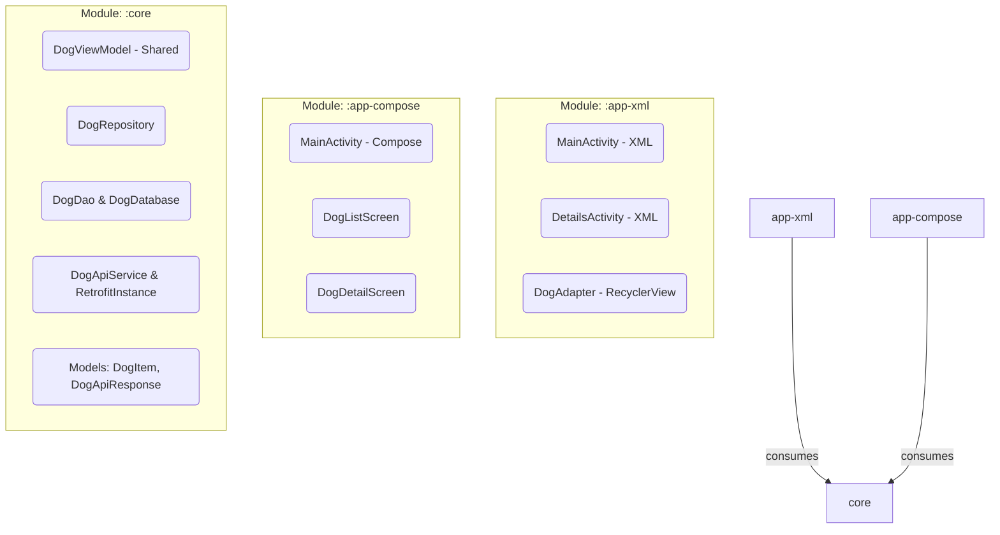

# DailyDog Multi-Module Architecture

This repository contains the refactored and evolved DailyDog application (from Tutorial 2). The application has been transitioned into a multi-module architecture where a shared core layer handles data and business logic, which is consumed by two distinct user interfaces: a traditional XML-based UI and a modern Jetpack Compose UI.

## 1. Module Diagram

The project structure enforces a clear separation of concerns, built with the following modules:

## 2. UI Contract

The `:core` module acts as the Single Source of Truth for both the UI applications. It exposes a clear contract so that any presentation layer can seamlessly fetch, cache, and display the dog images.

### Exposed Components from `:core`
- **Models**: `DogItem` representing the domain object (the dog image and favorite metadata).
- **Repository**: `DogRepository` provides suspension functions for data persistence and remote fetching (`fetchDogs`, `getFavorites`).
- **ViewModel**: `DogViewModel` handles UI state. Both applications share this ViewModel, meaning they observe the same state properties (`dogs: LiveData<List<DogItem>>`, `isLoading`, `errorEvent`).

### Interaction Flow
1. The UI module (XML or Compose) sets up observers or Compose state collection on the `DogViewModel`.
2. User actions (e.g., clicking on a dog to favorite it) call functions on `DogViewModel` or the local Room Database directly (via `DogDao`).
3. Changes to the database trigger state refreshes within the `ViewModel`, updating the UI layer smoothly.

## 3. Refactoring Plan

The migration from a single monolithic `:app` module to this multi-module architecture occurred in the following phases:

1. **Extraction of Shared Logic**: Data layers (Room entities, DAOs, Retrofit API interfaces) and Business layers (Repositories, ViewModels) were moved from the base `:app` module into a newly created Android Library module named `:core`.
2. **Refactoring the Legacy UI**: The existing `:app` module was renamed to `:app-xml`. Redundant dependencies like Room and Retrofit were abstracted through the `:core` module. `:app-xml` was updated to `implementation(project(":core"))`.
3. **Introduction of Jetpack Compose**: A new module `:app-compose` was initialized. This module purely acts as a presentation layer, fully implemented using Jetpack Compose, and consumes the same `:core` module as `:app-xml`.

## 4. Compose-Exclusive Features

To demonstrate the power and declarative nature of Jetpack Compose, `:app-compose` implements specific features not present in the XML version:

- **Adaptive Layouts**: The `DogListScreen` utilizes `LazyVerticalGrid` with `GridCells.Adaptive`, adjusting seamlessly to different screen sizes and orientations without the need for multiple layout configuration files.
- **Dynamic Theming**: The app embraces `MaterialTheme` color schemes that automatically respond to the system's Dark/Light mode preference (`isSystemInDarkTheme()`).
- **Animations**: The "Favorite" functionality incorporates micro-animations via `animateContentSize`. When clicking the heart icon, it scales dynamically, providing immediate, fluid user feedback.
